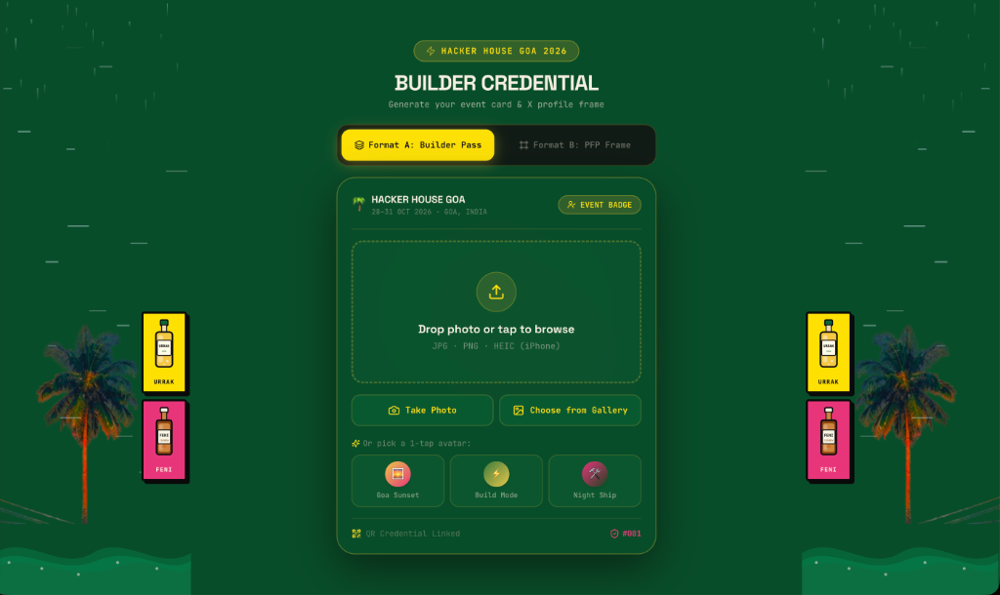
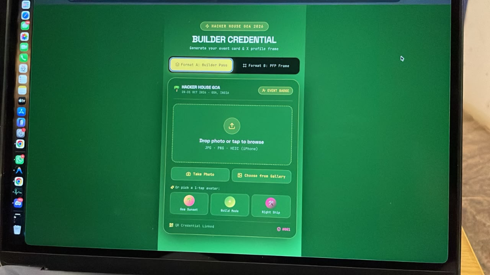
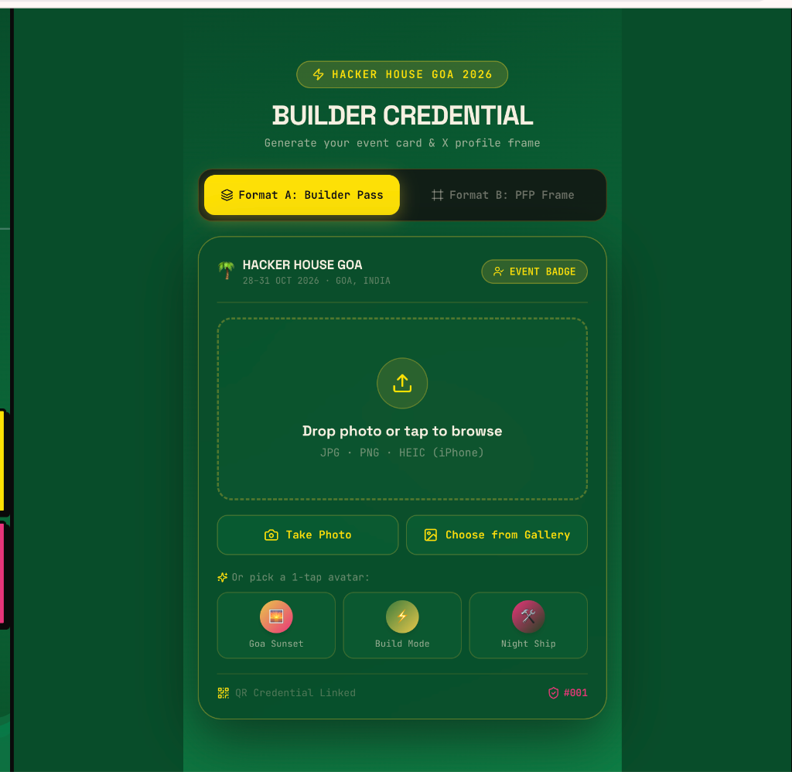

# ⚡ HH Goa 2026 — Builder ID Card & Boarding Pass Generator

> **The Official Builder Credential & Vintage Boarding Pass Generator for Hacker House Goa 2026.**  
> Built with **React**, **Vite**, **Tailwind CSS**, **Framer Motion**, and a custom **HTML5 Canvas 2D Engine**.

---

## 📸 Preview & Results

### 1. Interactive Web Application (Step 1 & Step 2 UI)


### 2. 1080x1920 Vintage Boarding Pass Export Target


### 3. Glassmorphic & Neo-Brutalist Atmospheric UI


---

## 🌟 Key Features

* **🎫 "The Vintage Boarding Pass" Canvas Engine (1080x1920, 9:16 Ratio)**
  * Pure **HTML5 Canvas 2D** rendering programmatically builds a 1080x1920 high-res vertical boarding pass tailored for mobile wallet cards and social sharing.
  * **Deep Forest Green (`#0F5132`)** base with an ornate Coral (`#FF5E4D`) outer border and Gold (`#F5A623`) dashed inner border (`[15, 15]`).
  * **Top Section**: Headline banner, radiating sunbeam line-art, compass rose, flight arcs, and a double-ringed circular profile photo (`Radius: 200px`).
  * **`DEPARTURE` & `ARRIVAL` Flight Panels**: Solid Gold & Coral header tabs with Neo-Brutalist offset black shadows, flight-style grid data (Passenger Name, Builder ID `#001`, Role/Title, Stack, and 3-Words Description).
  * **Passport Stamps & QR**: Embedded QR Code (`"SCAN TO VERIFY"`), Gold circular compass stamp (`HACKER HOUSE ★ GOA ★`), Coral rectangular postal cancellation stamp, and overlapping ocean waves at the bottom edge.

* **🔍 2-Step Wizard & Simulated Face Scan Validation**
  * **Step 1: Upload Photo / Avatar Selection**: Clean drag-and-drop zone, camera/gallery shortcuts, and animated 1-tap avatars.
  * **Face Scan Validation State**: Uploading a photo triggers a 1.5-second simulated scanning state with a laser scanline moving across the photo (`"Scanning for human face... 🔍"` → `"Face Detected ✓"`).
  * **Bypass via 1-Tap Avatars**: Selecting a preset avatar immediately advances to Step 2.

* **🎨 1-Tap Animated Avatars**
  * Floating, breathing **Framer Motion** avatar cards (`Goa Sunset 🌅`, `Build Mode ⚡`, `Night Ship 🛠️`) with continuous `y`-axis bobbing physics and spring-hover scaling.

* **🌊 Coastal Goa Physics & Ambience**
  * Live background animations featuring real swaying palm trees (`@keyframes tree-sway-left/right`), floating vector clouds (`@keyframes cloud-drift-1/2/3/4`), full-screen wind breeze particles, and falling coastal rain mist.

* **📱 Mobile & iPhone HEIC Support**
  * Integrated `heic2any` conversion pipeline allowing iPhone users to upload `.heic`/`.heif` camera photos directly from iOS devices.

* **🔒 Mandatory Field Validation & Forced .PNG Export**
  * Generate/Download buttons are strictly locked until all mandatory inputs (**Name**, **Stack/Role**, **3 Words**, **Goa Vibe**) are filled. Exports are strictly enforced as high-quality `.PNG`.

---

## 🛠️ Tech Stack

* **Core**: React 18, JavaScript (ES6+), HTML5
* **Build Tool**: Vite 6
* **Styling**: Tailwind CSS v4, Custom Design Tokens (Space Grotesk & JetBrains Mono)
* **Animations**: Framer Motion, Canvas Confetti
* **Canvas Processing**: HTML5 Canvas 2D API, `qrcode`
* **Mobile Image Support**: `heic2any`

---

## 🚀 Quick Start

### 1. Clone the repository
```bash
git clone https://github.com/your-username/hh-goa-2026-builder-card.x.git
cd hh-goa-2026-builder-card
```

### 2. Install dependencies
```bash
npm install
```

### 3. Run local development server
```bash
npm run dev
```
Open [http://localhost:3000](http://localhost:3000) (or `http://localhost:3001`) in your browser.

### 4. Build for production
```bash
npm run build
```

---

## 📁 Project Structure

```text
.
├── assets/                  # Screenshot previews and design references
│   ├── vintage-boarding-pass-target.png
│   ├── ui-preview.png
│   └── ui-preview-dark.png
├── public/                  # Static assets & palm tree visuals
│   └── palm-tree.png
├── src/
│   ├── components/
│   │   └── WalletPass.jsx   # 2-Step form wizard & glassmorphic UI card
│   ├── utils/
│   │   ├── canvasDrawer.js  # 1080x1920 Vintage Boarding Pass Canvas Engine
│   │   ├── heic.js          # HEIC image conversion handler
│   │   └── titles.js        # Stack & builder title mappings
│   ├── App.jsx              # Main orchestrator & coastal background physics
│   ├── index.css            # Tailwind theme tokens & keyframes
│   └── main.jsx             # React entrypoint
├── index.html
├── package.json
└── vite.config.js
```

---

## 📄 License

Distributed under the **MIT License**. See `LICENSE` for more information.

---

<p center="align">
  <b>Built for Hacker House Goa 2026 🌴⚡ Building something real in Goa.</b>
</p>
